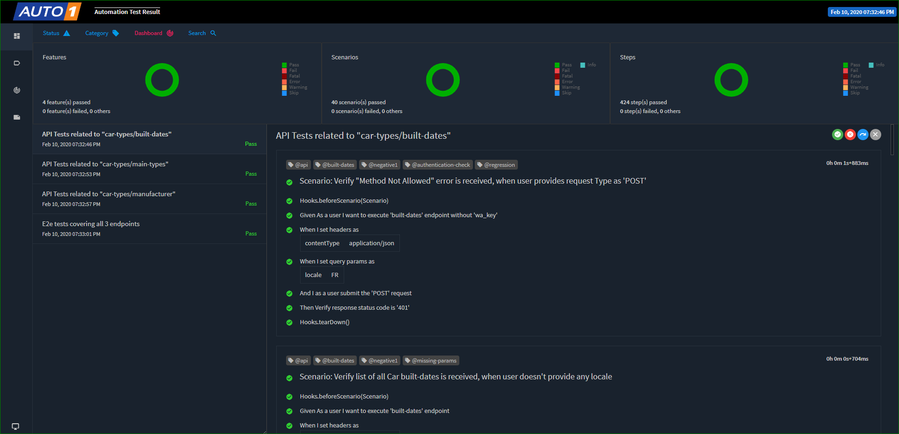
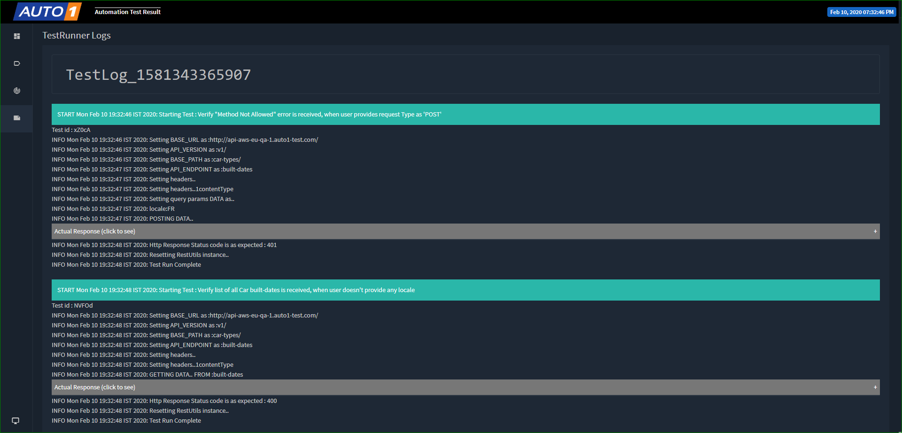

# Project Summary

This framework uses Java-Cucumber-TestNG with RestAssured for testing.

- For Reporting Extent Reports v4 are used and for logging Log4J is used 
- ```"features/"``` contains all the Test Scenario features written in Gherkin
- ```"output/<env>/"``` contains all the Test Reports related resources
- ```"src/main/java > com.auto1.qa.global.utils"``` contains ALL the utility functions used in project
- ```"src/test/java > com.auto1.qa.runner"``` contains all test runners for running this project
- ```"src/test/java > com.auto1.qa.context"``` contains required test context classes and ```ContextEnums.java``` contains list of stored values for a Test Run
- ```"src/test/java > com.auto1.qa.models"``` contains all API response POJOs
- ```"src/test/java > com.auto1.qa.stepdefs"``` contains all the step definitions
- ```"src/test/resources > runner.config"``` contains all the TestRunner configurations required when running from IDE
- ```"src/test/resources > <env>/env.config"``` contains all the environment specific configuration settings related to an env
- ```"src/test/resources > schemas"``` contains JSON response schemas


## How To Run :

**Pre-requisites** - Adding environment variables
- Under ```"src/test/resources > environments/dev/env.config"``` add BASE_URL & wa_key value (if running on dev)
- Under ```"src/test/resources > environments/qa/env.config"``` add BASE_URL & wa_key value (if running on qa)

**Method#1** - Running Via IDE
 
 **Pre-requisite:**
 ```runner.config``` file should have following properties:
 ```ENV	= [test, dev]```
 ```MODE = [api]```
 
 - Goto ```src/test/java > com.auto1.qa.runner```
 - Right click on ```"CucumberTestRunnerReporter.java"``` > ```Run As``` > ```TestNG Test```
 
 
**Method#2** - Running Via Command Line
 - Open ```"Command Prompt"```
 - Goto ```Project directory```
 - type following command : 
 > 
 		- mvn install
 		- mvn test -Denv="qa" -Dmode="api" -Dcucumber.options="features/*" -Dcucumber.options="--tags @api" 
 		
**Maven Attributes :**  
 > 
 		**-Denv** values "qa" or "dev"  
 		**-Dmode** can take value "api"  
 		**-Dcucumber.options="features/*"** specifies path to features folder where all ```.feature``` files are stored  
 		**-Dcucumber.options="--tags @api"** specify "@api" to run all test features or a particular tag like "@e2e" to run single feature  
 		
 **Running in parallel :**  
    When running tests in parallel, supply following additional mandatory attributes
 > 
 		**-Dtest=CucumberParallelTestRunnerReporter** selects execution via parallel test runner [Required only in parallel execution]  
 		**-Dthreadcount= (should be > 1)** number of threads threads to be invoked [Required only in parallel execution]  
 			  
 		
**Test Suite Selection**:

  User can select pre-defined tags like "@api" (For running all test), "@regression" or "@negative" to select type of a test suite
 
   a) Running multiple tags at once (run all tests which has tags, 'tag1' **OR** 'tag2'):
    
 	-Dcucumber.options="--tags @tag1,@tag2"
 	
   b) Running a subset of scenarios (run all tests which has tag, 'tag1' **AND** 'tag2'):
     
  	-Dcucumber.options="--tags @tag1 --tags @tag2"
  	
   c) Ignoring a subset of scenarios (run all tests except tag 'tag1'  i.e. **NOT** 'tag1'):
       
    -Dcucumber.options="--tags ~@tag1"

 		
## Run Report: 
Test Reports can be found at path ```\output\<env>\Test_Report.html``` (Automatically created after first run) 



## Logs: 

Logs are stored under respective date folder under "output/<env>/logs" directory path ```\output\<env>\logs\TestLog_<Timestamp>``` (Automatically created after first run), or in report under Logs Tab.



